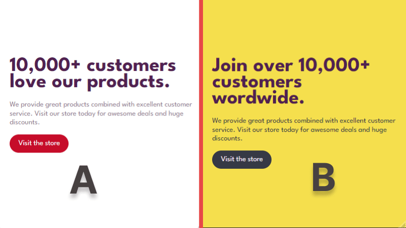

# A/B testing in Go sample

[Read the blog post here](https://configcat.com/blog/)

This is a demo website built with the Go programming language. In the article, it was used in a demo A/B test experiment where each variation of the home page was released to a user segment to gather metrics. In the end, we compared metrics to determine which variation performed best.



## Build & Run

### Prerequisites

- [Go](https://go.dev/) version 1.19


### Running the app
1. Clone this repo

2. Run the following command with 'make'

```sh
make run
```

or Manually run the follow commands:

```sh
go build

./ab-testing-in-go-sample
```

## Learn more

- [Go Documentation](https://go.dev/doc/) - learn about Go features and its API.
- [Learn Go](https://go.dev/doc/tutorial/getting-started) - Getting started with Hello, World.

[**ConfigCat**](https://configcat.com) also supports many other frameworks and languages. Check out the full list of supported SDKs [here](https://configcat.com/docs/sdk-reference/overview/).

You can also explore other code samples for various languages, frameworks, and topics here in the [ConfigCat labs](https://github.com/configcat-labs) on GitHub.

Keep up with ConfigCat on [Twitter](https://twitter.com/configcat), [Facebook](https://www.facebook.com/configcat), [LinkedIn](https://www.linkedin.com/company/configcat/), and [GitHub](https://github.com/configcat).

## Author
[Chavez Harris](https://github.com/codedbychavez)

## Contributions
Contributions are welcome!
